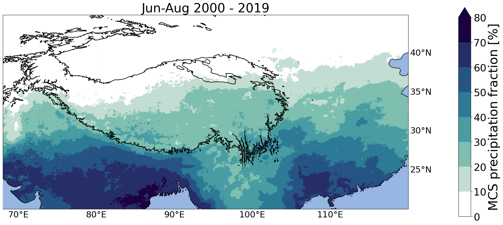

Overview of databases that contain information on mesoscale convective systems (MCSs tracked based on satellite observations.  

# Global MCS datasets

---

## PyFLEXTRKR Global MCS Tracking Data

A global (60°S–60°N) long-term (**2000–2020**) high-resolution (**∼10 km, hourly**) mesoscale convective system (MCS) database was developed by tracking MCS jointly using geostationary satellite infrared brightness temperature (Tb) and precipitation feature (PF) characteristics from the Integrated Multi-satellitE Retrievals for GPM (IMERG) precipitation data sets ([Feng et al. 2021](https://doi.org/10.1029/2020JD034202)). Independent validation shows that the satellite-based MCS data set is able to reproduce important MCS statistics derived from ground-based radar network observations in the United States and China. By carefully considering key PF characteristics in addition to Tb signatures, the new method significantly improves upon previous Tb-only methods in detecting MCSs in the midlatitudes for all seasons. The [PyFLEXTRKR](https://doi.org/10.5194/gmd-16-2753-2023) algorithm used to produce the MCS tracking dataset is available on [GitHub](https://github.com/FlexTRKR/PyFLEXTRKR).

**Climatology** of global MCS annual mean number, precipitation amount, and fraction to total precipitation derived from the dataset is shown below.

### Description of the MCS Dataset

The detailed documentation of the MCS tracking dataset can be found [**here**](https://portal.nersc.gov/project/m1867/mcs_global_v2/PyFLEXTRKR_MCS_Tracking_Data_Readme.pdf). In the current V2 MCS database (**June 2000 - December 2020**), there are two sets of files: 1. track statistics data, 2. pixel-level data.

1. Contains summary MCS statistics such as time, location, lifetime, size, rainfall statistics, movement, etc. (full global data volume is ~5 GB). 

2. Contains the full Tb, IMERG precipitation, and tracked MCS masks on the native IMERG 0.1 degree grid at hourly resolution (full global data volume is ~2.3TB). An example of a snapshot MCS mask file is provided below.

### Data Access

To accesss the data, please contact: [Zhe.Feng@pnnl.gov](mailto:zhe.feng@pnnl.gov)

### References

Feng, Z., Leung, L. R., Liu, N., Wang, J., Houze, R. A., Li, J., et al. (2021). A Global High‐Resolution Mesoscale Convective System Database Using Satellite‐Derived Cloud Tops, Surface Precipitation, and Tracking. Journal of Geophysical Research: Atmospheres, 126(8), doi:[10.1029/2020JD034202](https://doi.org/10.1029/2020JD034202).

Feng, Z., Hardin, J., Barnes, H. C., Li, J., Leung, L. R., Varble, A., & Zhang, Z. (2023). PyFLEXTRKR: a flexible feature tracking Python software for convective cloud analysis. Geosci. Model Dev., 16(10), 2753-2776, doi:[10.5194/gmd-16-2753-2023](https://doi.org/10.5194/gmd-16-2753-2023)

# Regional MCS datasets

---

## MCS Database over the United States

The MCS database over Contiguous United States (CONUS) is a long-term (**2004-2017**) high-resolution (**4 km, 1 hourly**) storm system dataset that tracks individual MCS events. The MCS database is produced by tracking MCS jointly using geostationary satellite infrared brightness temperature (Tb) and the GridRad mosaic 3D NEXRAD radar data set ([Feng et al. 2019](https://doi.org/10.1175/JCLI-D-19-0137.1)). The database also contains the multi-sensor Stage IV precipitation data.

### Description of the MCS Dataset

The detailed documentation of the MCS tracking dataset can be found [**here**](https://portal.nersc.gov/project/m1867/mcs_gridrad_v2/MCS_Database_GridRad_Readme_v2.pdf).

**Climatology** of U.S. MCS convective feature echo-top heights and PF areas derived from the dataset is shown below.

### Data Access

The U.S. MCS database is available on the U.S. Department of Energy Atmospheric Radiation Measurement (ARM) program website: [https://doi.org/10.5439/1571643](https://doi.org/10.5439/1571643). A free account registration is required: [https://adc.arm.gov/armuserreg/#/new](https://adc.arm.gov/armuserreg/#/new).

### References

Feng, Z., Houze, R. A., Leung, L. R., Song, F., Hardin, J. C., Wang, J., et al. (2019). Spatiotemporal Characteristics and Large-scale Environments of Mesoscale Convective Systems East of the Rocky Mountains. Journal of Climate, 32(21), 7303-7328, doi:[10.1175/JCLI-D-19-0137.1](https://doi.org/10.1175/JCLI-D-19-0137.1).

## MCS Database over East Asia/ Tibetan Plateau region 

The MCS database over East Asia covers the past two decades (**2000-2019**) and holds information on MCS tracks identified in satellite data (GPM IMERG and merged IR brightness temperatures from geostationary satellites). This database covers the Tibetan Plateau and its surrounding continental areas. Due to the relatively large area requirement, this database contains mainly large MCSs, but contains also a subdataset with  meso-beta convective systems over the mountainous regions.

**Satellite image** showing large storm systems over, south, and east of the Tibetan Plateau. 

**Climatology** of MCS-associated summer precipitation over the Tibetan Plateau and surrounding river basins. 

 

### Data Access 

The MCS track statistics can be downloaded from [Zenodo](https://zenodo.org/record/4767152). The Mask files can be obtained upon request: julia.kukulies@gu.se. 

### References 

Kukulies, J., Chen, D., & Curio, J. (2021). The role of mesoscale convective systems in precipitation in the Tibetan Plateau region. Journal of Geophysical Research: Atmospheres, 126(23), e2021JD035279, doi:[10.1029/2021JD035279](https://agupubs.onlinelibrary.wiley.com/doi/10.1029/2021JD035279). 

Kukulies, J., Lai, H. W., Curio, J., Feng, Z., Lin, C., Li, P., Sugimoto, S. & Chen, D. (2023). Mesoscale convective systems in the third pole region: Characteristics, mechanisms and impact on precipitation. Frontiers in Earth Science, 11(PNNL-SA-184361), doi:[10.3389/feart.2023.1143380/](https://www.frontiersin.org/articles/10.3389/feart.2023.1143380/full#main-content). 

## MCS Database over Tropical Africa and Eastern Atlantic 

## TAMS Regional MCS Tracking Data 

The MCS database over Tropical Africa and Eastern Atlantic is a 5-year climatology (2004-2008) for August through September. The data uses TAMS and holds information about each MCS and corresponding rain rates from MSG geostationary IR (ch9) satellite and IMERG data. For each year there are three different types of MCS files including MCS track files for different assigned background flows. The data is in .mat form (MATLAB) but can be readable via Python. 

**25 tracks of different types of MCSs by TAMS from 17 to 21 Aug 2006 during the same time a developing AEW that then became Tropical Storm Debby was active**

### Data Access

The MCS database can be downloaded from [Penn State Data Commons](https://www.datacommons.psu.edu/commonswizard/MetadataDisplay.aspx?Dataset=6243). Please refer to the README.txt file for more information and/or email: knocasio@ucar.edu. 

### Reference

Kelly M. Núñez Ocasio, Jenni L. Evans, and George S. Young. Tracking Mesoscale Convective Systems that are Potential Candidates for Tropical Cyclogenesis. Monthly Weather Review, 148(2):655 – 669, Feb 2020. URL: [https://journals.ametsoc.org/view/journals/mwre/148/2/mwr-d-19-0070.1.xml], (doi:10.1175/MWR-D-19-0070.1).

## African Easterly Waves-MCSs Coupled System Database over Tropical Africa and Eastern Atlantic 

The African easterly wave-MCS dataset over Tropical Africa and Eastern Atlantic is a 5-year climatology (2004-2008) for August through September. The dataset was developed using a combination of TAMS MCS tracks and an African easterly wave (AEW) track data. AEW-MCS dataset is structured to include information about the tracks, characteristics, and rainfall for MCSs, each one matched to its corresponding developing AEW (becomes a tropical cyclone) and non-developing AEW. The data also includes information about the earth-relative propagation speeds from both AEWs and associated MCSs as well as wave-relative speed for the MCSs.  

**Schematic of how MCSs ara matched to AEWs** 

 
### Data Access

The MCS database can be downloaded from [Penn State Data Commons](https://www.datacommons.psu.edu/commonswizard/MetadataDisplay.aspx?Dataset=6248). Please refer to the README.txt file for more information and/or email: knocasio@ucar.edu.  

### Reference

Kelly M. Núñez Ocasio, Jenni L. Evans, and George S. Young. A Wave-Relative Framework Analysis of AEW–MCS Interactions Leading to Tropical Cyclogenesis. Monthly Weather Review, 148(11):4657 – 4671, Nov 2020. URL: [https://journals.ametsoc.org/view/journals/mwre/148/11/MWR-D-20-0152.1.xml], (doi:10.1175/MWR-D-20-0152.1).
