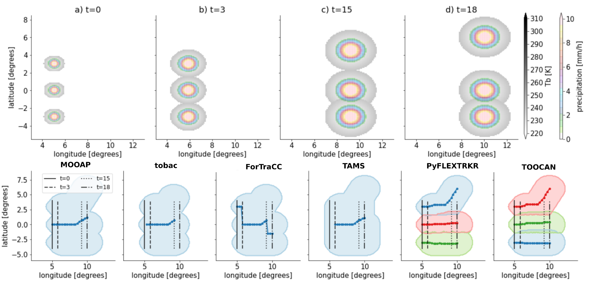

In an initiative of the [South America Affinity Group](https://ral.ucar.edu/projects/south-america-affinity-group-saag) [Deep Convection Working Group](https://ral.ucar.edu/projects/south-america-affinity-group-saag/deep-convection-working-group) led by Andreas Prein, we inter-compare different tracking algorithms for meso-scale convective systems.  

To understand how different tracking algorithms capture and interprete different cases of mesoscale convective systems, we present idealized cases with different merge-split situations.  

### Simple merge-split

*Figure Courtesy: Andreas Prein* 

